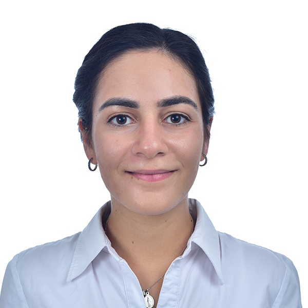
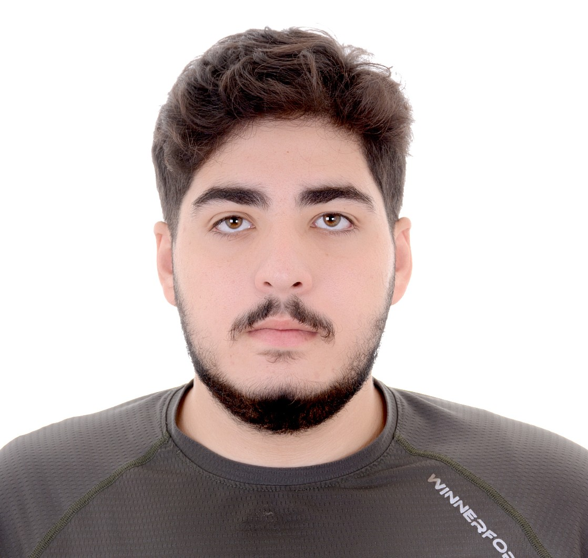
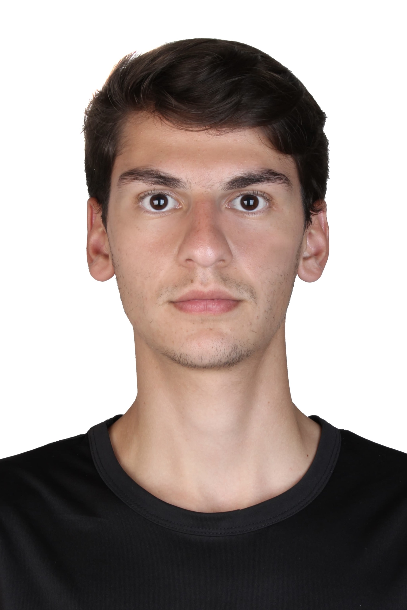

[RESEARCH](publications)        [TEACHING](teaching.md)
---

# Honein Dynamics Lab

<table style="border-collapse: collapse; border: none;">
  <tr style="border: none;">
    <td style="border: none;"></td>
  </tr>
</table>

The long-term vision of the \href{https://thh00.github.io}{Honein Dynamics Lab} is to develop accessible technology capable of producing physically accurate simulations of quasi rigid motion from video at low cost. Ultimately, this could enable applications such as mobile tools that teach motor skills ranging from bicycle riding to correct padel technique using only video data. Such technology would deepen our understanding of dynamic phenomena, improve motion diagnosis and optimization, and generate high quality datasets for training future machine learning models.

## Theresa Honein

<table style="border-collapse: collapse; border: none;">
  <tr style="border: none;">
    <td style="border: none;"></td>
    <td style="border: none;"> Assistant Professor at American University of Beirut (AUB) 
        Department of Mechanical Engineering  
        Email: theresa.honein at aub.edu.lb 
        Office: Bechtel 532 
        Office Phone: +961-1-340460 / 350000  Ext. 3429
        

      Subscribe on 
    

    </td>

  </tr>
</table>

My name is Theresa Honein. I earned my Ph.D. in Mechanical Engineering at the University of California, Berkeley in Summer 2024 under [Professor Oliver O'Reilly](https://me.berkeley.edu/people/oliver-m-oreilly). I am interested in utilizing tools from dynamics and mechanics to create physically accurate simulations of seemingly simple, yet actually difficult to model, phenomena. I have previously studied the treatment of holonomic and nonholonomic constraints in different formulations of the equations of motion. I am currently interested in leveraging recent advances in numerical methods to model the nonsmooth dynamics of impacting rigid bodies.

<!-- 

   -->
  <!--  -->
  <!--  -->
  <!--  -->
<!-- 
 -->

## Karim Braidi

<table style="border-collapse: collapse; border: none;">
  <tr style="border: none;">
    <td style="border: none;">
      

        
      

    </td>
    <td style="border: none;">
      Email: kab30 at mail.aub.edu   
      My name is Karim Braidi. I am a graduate student at the American University of Beirut (AUB) working under the supervision of Dr. Theresa Honein. My research interests are rigid body dynamics and multibody systems, with a focus on analytical and numerical formulations. I’m particularly interested in data-driven modeling approaches for dynamical systems, including reduced-order modeling and integration of machine learning techniques in classical mechanics. 
    </td>
  </tr>
</table>

## Wafic Itani

<table style="border-collapse: collapse; border: none;">
  <tr style="border: none;">
    <td style="border: none;">
      

        
      

    </td>
    <td style="border: none;">
      Email: woi00 at mail.aub.edu   
      My name is Wafic Itani, and I am a second-year mechanical engineering undergraduate student at AUB. I am passionate about motorsports, vehicle dynamics, and dynamics in general, with a strong interest in understanding and improving the motion of mechanical systems. I approach challenges with curiosity and persistence, always eager to push myself to learn new concepts and expand my skills. I enjoy working in collaborative environments where ideas are exchanged openly, and I value the process of turning theoretical knowledge into practical, real-world applications.
    </td>
  </tr>
</table>

## Maykel Tohme

<table style="border-collapse: collapse; border: none;">
  <tr style="border: none;">
    <td style="border: none;">
      

        
      

    </td>
    <td style="border: none;">
      Email: mit12 at mail.aub.edu   
      I am currently a second year Mechanical Engineering undergraduate student at the American University of Beirut, motivated through an appreciation of dynamics, fluid mechanics, and aerodynamics. I aim to bridge the gap between theory and high-performing engineering.
      At the moment, I am part of the Baja SAE Suspension Subteam at my university working on optimizing vehicle components for off-road durability. I am developing expertise in simulation and analysis through Finite Element Analysis (FEA) for structural verification and Computational Fluid Dynamics (CFD) for flow analysis. These abilities come from practical experience in the construction of autonomous robots and customized unmanned aerial vehicles using Solidworks, Arduino, and various sensors.
    </td>
  </tr>
</table>

## Join our research group!

I am currently recruiting motivated undergraduate and M.S. students to join my research team. Our work focuses on reproducing the accurate dynamics of the human body using motion capture technologies.

Requirements:

- Interest in dynamics, motion analysis, biomechanics or related fields
- Dedication to hands-on and computational research

To Apply:
Please send the following to theresa.honein at aub.edu.lb:

- Unofficial Transcript
- Resume
- Brief Letter of Intent (outlining your interest and any relevant experience)

Join us in advancing our understanding of human body dynamics!

