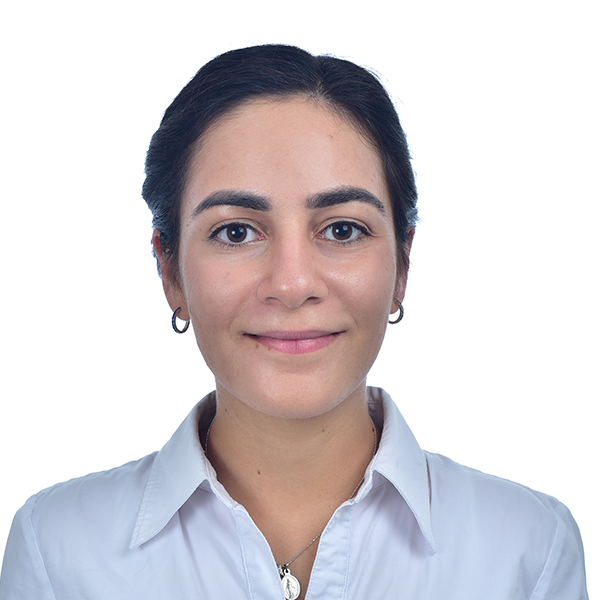

[RESEARCH](publications)        [TEACHING](08-2024-dynamics/homepage.md)
---

# Biography

Assistant Professor at American University of Beirut 
Department of Mechanical Engineering 

 
My name is Theresa Honein. I earned my Ph.D. in Mechanical Engineering at the University of California, Berkeley in Summer 2024 under [Professor Oliver O'Reilly](https://me.berkeley.edu/people/oliver-m-oreilly). I am interested in utilizing tools from dynamics and mechanics to create physically accurate simulations of seemingly simple, yet actually difficult to model, phenomena. I have previously studied the treatment of holonomic and nonholonomic constraints in different formulations of the equations of motion. I am currently interested in leveraging recent advances in numerical methods to model the nonsmooth dynamics of impacting rigid bodies.

### Contact 

Email: theresa.honein at aub.edu.lb 
Office: Bechtel 532 
Office Phone: +961-1-340460 / 350000  Ext. 3429

### Recruiting

I am currently recruiting motivated undergraduate and M.S. students to join my research team. Our work focuses on reproducing the accurate dynamics of the human body using motion capture technologies.

Requirements:

- Interest in dynamics, motion analysis, biomechanics or related fields
- Dedication to hands-on and computational research

To Apply:
Please send the following to theresa.honein at aub.edu.lb:

- Unofficial Transcript
- Resume
- Brief Letter of Intent (outlining your interest and any relevant experience)

Join us in advancing our understanding of human body dynamics!