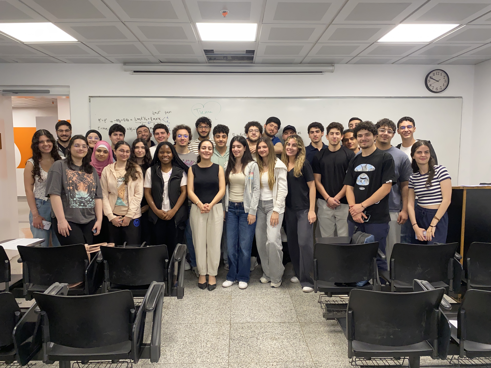

[RESEARCH](publications)        [TEACHING](teaching.md)
---

# Classes

## MECH230

- [Fall 2024](08-2024-dynamics/homepage.md)
- [Spring 2025](https://mech230.github.io)
- [Summer 2025](2025-06-dynamics/homepage.md)

## Photo Gallery

  

    
    
Fall2024 MECH230 Section2

  

  

    
    
Spring2025 MECH230 Section1

  

  

    
    
Spring2025 MECH230 Section5

  

# Final Year Projects

## AY 2024-2025
- `Designing and Building a Racing Wheelchair` by Bahaa Abed, Kevin Ibrahim, Leatithia Zeitouny and Lynn Barhouche. [[Poster](???), [Video](https://youtu.be/WT_aFLQ14Ss?si=7zVLr2RhIYNThZ7k)]

- `Modeling and Building a Robotic Hand` by Joe Azzi, Karelle Honein, Joe Moussa and Leo Tchennozian.

## Photo Gallery

  

    
    
Fall2024 MECH230 Section2

  

